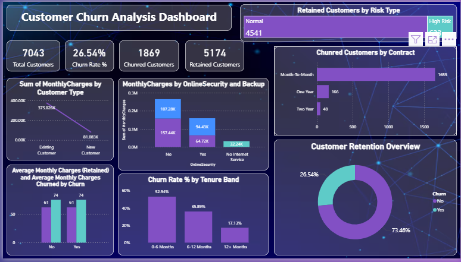

Customer Churn Analysis Dashboard (Power BI)

Project Overview
This project analyzes customer churn data using Power BI to identify patterns, trends, and key factors affecting customer retention.

The dashboard was built while learning Power BI from YouTube tutorials and implementing the concepts in a real-world business scenario. The project demonstrates hands-on experience in data visualization, business analysis, and insight generation.

Business Problem
Customer churn is a major challenge for businesses as losing customers directly impacts revenue and growth. Understanding customer behavior helps organizations improve retention strategies and enhance customer satisfaction.

This dashboard helps analyze:

- Customer churn rate
- Customer demographics
- Service usage patterns
- Revenue impact of churn
- Key factors influencing customer attrition

Tools & Technologies Used
- Power BI
- Data Cleaning & Transformation
- Data Visualization
- DAX (Data Analysis Expressions)

Dashboard Features
- Overall churn summary
- Customer segmentation analysis
- Demographic insights
- Service usage analysis
- Interactive filters and visualizations
- KPI indicators for monitoring business performance

Business Insights
Based on the dashboard analysis:

- Customers with month-to-month contracts show higher churn rates.
- Customers with higher monthly charges are more likely to leave.
- Customers using fewer services tend to churn more frequently.
- Long-term customers show better retention.
- Electronic payment methods show higher churn compared to automatic payments.

These insights help businesses identify high-risk customers and improve retention strategies.

Business Recommendations
Based on the analysis, businesses can:

- Offer incentives for long-term contracts.
- Provide loyalty rewards for high-risk customers.
- Improve customer support for new customers.
- Provide bundled service packages to increase engagement.
- Offer discounts or personalized plans to customers with high monthly charges.
- Encourage customers to switch to automatic payment methods.

These strategies can help reduce churn and improve customer retention.

Dataset

The dataset contains customer-related information such as:

- Customer details
- Services subscribed
- Payment details
- Contract information
- Churn status

Future Improvements
- Add churn prediction using machine learning.
- Perform customer lifetime value analysis.
- Build automated reporting dashboards.
- Implement advanced customer segmentation.
- Integrate real-time data updates.

Acknowledgement

This project was created as part of my learning journey by following a Power BI tutorial on YouTube and implementing the concepts independently.

Author

Abdul Mujeeb

